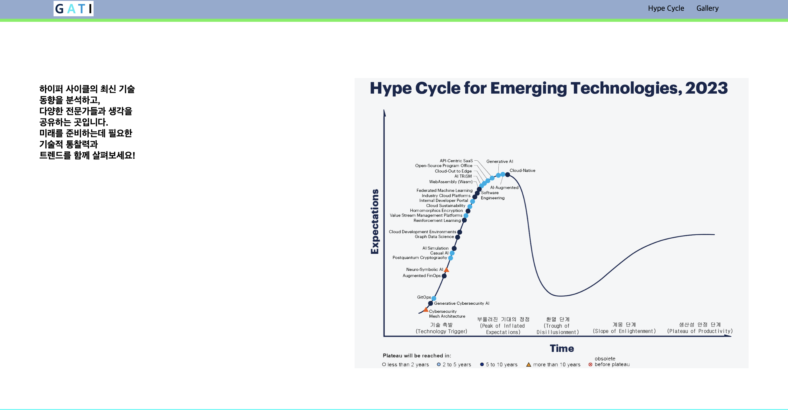
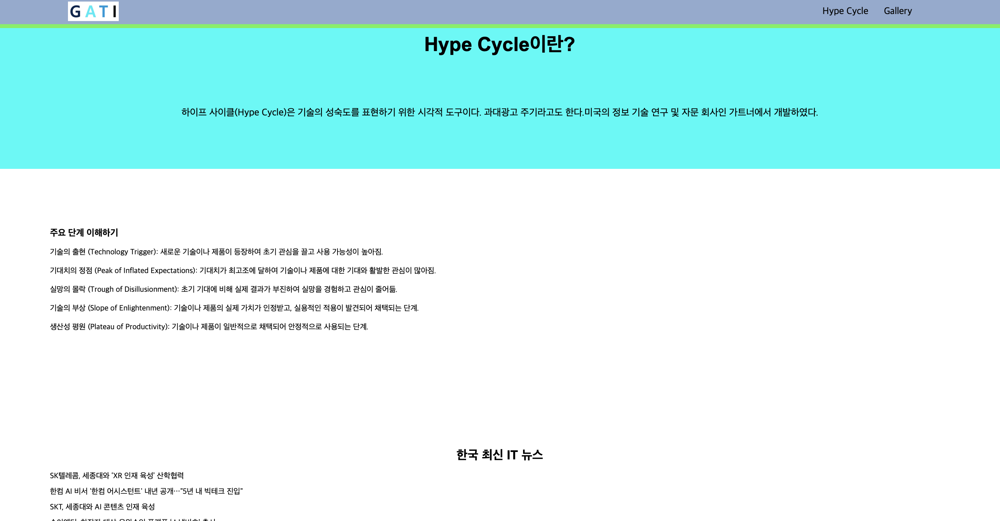
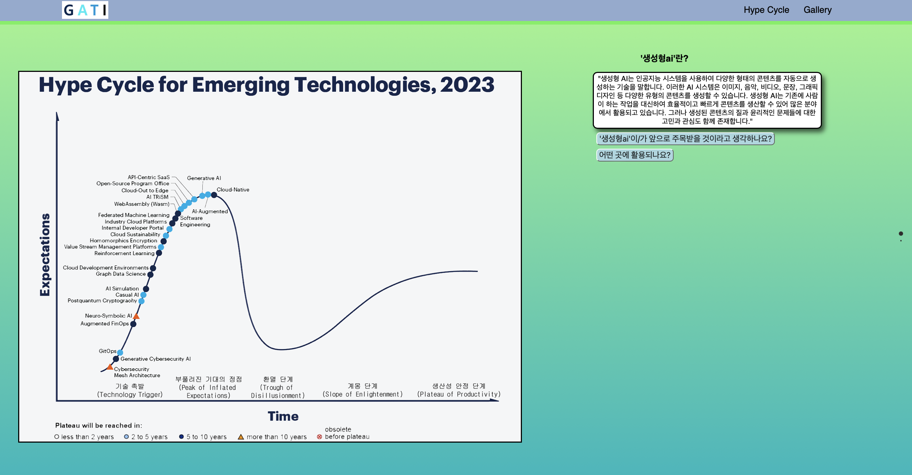
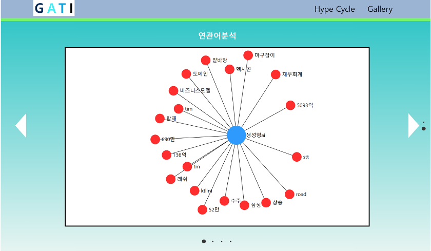
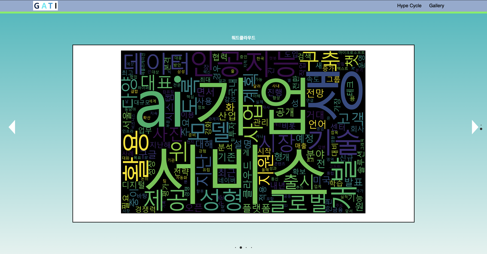
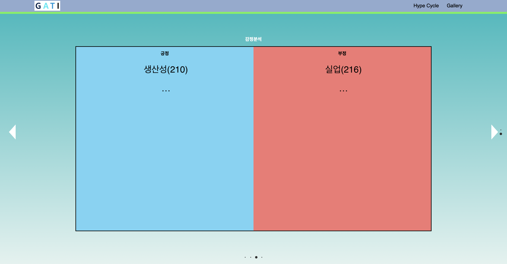
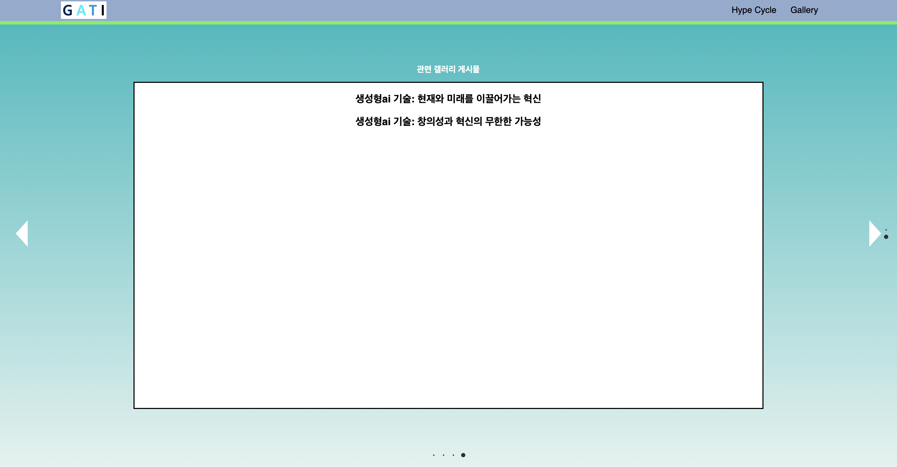

# stress
문서 작성자 : 윤준현  
최종 수정자 : 윤준현  
최종 수정일 : 2023.11.28  

프로젝트 이름 : GATI
- Gartner + IT  
  
캡스톤디자인 팀 '외않됀데?'의 팀프로젝트 주제 'Gartner로 보는 한국 IT 기술 트렌드'의 저장소  
  
참여인원 : 3명 - 윤준현(ikaman3), 이민재(dlalswo5644), 강민호(SincereSnail)  
작업 기간 : 2023.09.20 ~ 2023.11.26 (약 2개월)  
사용 기술 : Backend(Python, FastAPI), Data analysis(Python, Tensorflow, KoNLPy), Frontend(HTML, CSS, JS),  Server(AWS EC2), DB(AWS RDS, MySQL)  
  
프로젝트 목표:
1. 웹 사이트를 POC(Proof of Concept)까지 개발
2. 텍스트 데이터 분석의 기본적인 개념 및 개발 방법 학습
3. 클라우드 서비스를 이용한 서버 구축과 배포 학습
4. Git, Github을 이용한 협업 방식 습득
5. 원활한 유지보수를 위한 문서화 습관 들이기
    
## How to Use
Required : Python 3.6+
  
### Install
셸에서 프로젝트의 실행파일이 있는 경로까지 이동하고, 아래의 명령어를 입력하여 필요한 모듈을 설치한다.  
```
pip3 install -r requirements_stress.txt
```
- requirements_stress.txt : 이 프로젝트에 필요한 Dependency를 모아둔 텍스트 파일
  - fastapi : 백엔드 API 개발에 사용하는 프레임워크(Node.js의 express)
  - uvicorn : lightweight(매우 가벼운) ASGI 서버
      - fastapi framework만으로는 웹 개발을 할 수 없고, ASGI와 호환되는 웹 서버가 필요함
      - 비동기 방식이 가능한 python web server framework(Fastapi가 대표적)와 application 간의 표준 interface를 제공함
  - wordcloud, matplotlib, konlpy : 데이터 분석에 필요한 모듈
  
### Run
셸에 아래의 명령어를 입력하여 서버를 시작한다.
```
uvicorn main:app --reload
```
또는  
```
python -m uvicorn main:app --reload
```  
- main : 파일 main.py (파이썬 "모듈"). 확장자가 .py이라면 다른 이름으로도 가능하다.
- app : main.py 내부의 app = FastAPI() 줄에서 생성한 오브젝트. 오브젝트 이름을 app 이외의 다른 이름으로 선언했다면 그 이름을 사용한다.
- --reload : 코드 변경 후 서버 재시작. 개발에만 사용한다.
  
### API Test Docs
FastAPI는 Swagger UI를 사용하여 자동 대화형 API 문서를 제공한다. 해당 문서에서 빠르게 API를 테스트할 수 있다.  
서버를 시작하고 아래의 링크를 브라우저에 입력하여 접속한다.  
python 파일을 저장하여 서버를 reload 해야 수정된 소스코드가 적용된다.  
  
http://127.0.0.1:8000/docs  
    
## Git & Github collaboration
.gitignore : 다른 사람과 공유할 필요가 없거나 보안상 공개되면 안 되는 파일, 폴더를 명시하여 Git으로 관리되지 않도록 하는 파일  

### How to Use Github
[Reference](https://velog.io/@dongvelop/Github-협업하기-PR부터-merge까지)  
  
Required : Github Oraganization을 만들고 레포지토리를 생성한다. 참여자들이 해당 레포지토리의 멤버로 등록되어야 한다.  

1. Fork : Github의 협업 계정 Repository에서 Fork 버튼을 눌러 자신의 레포지토리로 가져온다.
2. Clone 및 Remote : 자신의 레포지토리 주소를 로컬의 Git과 연결한다. (CLI, GUI 알아서 사용)
3. Branch : 원본 repository의 main 브랜치를 안전하게 관리하기 위해 반드시 dev 브랜치에서 작업하고 push한다. 
  - ```dev```라는 이름의 브랜치를 만들고, 체크아웃(브랜치 이동)까지 동시에 할 경우 : ```git checkout -b dev```
  - ```dev```라는 이름의 브랜치를 생성만 하고 싶을 경우 혹은 이미 생성된 ```dev``` 브랜치로 이동할 경우 : ```git checkout dev```
  - 브랜치 목록 조회 및 현재 작업 중인 브랜치 확인 : ```git branch```
4. 작업 후 add & commit & push : 자신의 레포지토리의 ```dev``` 브랜치에 작업을 하고 add & commit & push 한다. 이때 ```dev``` 브랜치에 push하는 것을 명시적으로 작성할 것
  - ```git push origin dev```
5. Pull Request(PR) : 4번까지 완료했다면 자신의 Github 레포지토리로 돌아가자. 초록색으로 Compare & pull request 버튼이 활성화되어 있을 것이다. 해당 버튼을 눌러 메시지를 작성하고 PR을 보내자.  
(이후로는 원본 저장소의 관리자가 할 일)
  
6. 코드 리뷰 및 Merge PR : 원본 저장소 관리자는 PR을 받으면 변경내역을 확인하고 Merge 여부를 결정한다.
  - Github Oraganization의 repository에 브랜치를 여러개 만드는 것이 아니었다. 협업 계정은 main 브랜치 하나만 유지하고 각자의 레포지토리에서 dev 브랜치로 작업하는 것
7. Merge 이후 동기화 및 branch 삭제 : 원본 저장소에 Merge가 완료되면 로컬 ```main``` 브랜치와 원본 저장소의 코드를 동기화해야 한다.
  - 현재 변경 사항은 dev 브랜치에서 작성하여 적용되었으니, main 브랜치도 내용을 동기화한다. 자신의 Github repository에 들어가 브랜치가 main임을 확인하고, Sync fork를 눌러 Update branch 버튼을 누르자.
  - 이후, 로컬에 있는 main 브랜치와도 동기화를 시키기 위해 아래 명령어를 실행하자.
  ```
      git checkout main
      git pull origin main
  ```
  - 로컬 브랜치 삭제(필수 아님) : ```git branch -D dev```
  - 원격 브랜치 삭제(필수 아님) : ```git push origin --delete dev```
8. 이후 작업 : 코딩하기 전에 항상 자신의 Github repository에서 Sync fork 버튼을 확인하고, 활성화되어 있다면 버튼을 눌러 동기화하자. 그리고 ```git pull origin main```을 통해 로컬과 동기화를 시킨 후 3번 ~ 7번 작업을 반복한다.
  
### Writing Commit Messages
[Reference](https://velog.io/@msung99/Git-Commit-Message-Convension)  
  
이 프로젝트 규모가 커밋 메시지에 대한 강한 규약까지는 필요하지 않을 것 같음. 커밋할 때 타입과 제목 정도에만 신경쓰고 설명이 더 필요하다면 본문 정도만 작성하는 것으로 충분해보임.  
  
커밋 메시지는 제목, 본문(옵션), 꼬리말(옵션)로 구성한다.  
- type : 어떤 의도로 커밋했는지를 type 에 명시한다.(ex. feat, fix, docs)
- subject : 제목. 코드 변경사항에 대한 짧은 요약을 나타낸다.
- body : 긴 설명이 필요한 경우에만 본문 내용으로써 작성한다. 어떻게 작성했는지가 아닌, 무엇을 왜 했는지 를 작성한다. 즉, 부연설명이 필요하거나 커밋의 이유를 설명할 경우 작성한다.
- footer : issue tracker ID 를 명시하고 싶은 경우에 작성한다.
  
타입(Commit Type) : 아래와 같은 규약을 지켜 작성한다.
  - 타입은 '태그(tag) + 제목(subject)'으로 구성되며, 태그는 영어로 쓰되, 첫 문자는 대문자로 한다.
  - '태그: 제목'의 형태이며, ':' 뒤에 space가 있음에 유의
  - ex) Feat: board api
  
자주 사용하는 태그 종류
  - Feat : 새로운 기능을 추가하는 경우
  - Fix : 버그를 고친경우
  - Docs : 문서를 수정한 경우
  - Style : 코드 포맷 변경, 세미콜론 누락, 코드 수정이 없는경우
  - Refactor : 코드 리펙토링
  - Test : 테스트 코드. 리펙토링 테스트 코드를 추가했을 때
  - Chore : 빌드 업무 수정, 패키지 매니저 수정
  - Design : CSS 등 사용자가 UI 디자인을 변경했을 때
  - Rename : 파일명(or 폴더명) 을 수정한 경우
  - Remove : 코드(파일) 의 삭제가 있을 때
  
(이후 본문, 꼬리말에 대한 내용은 우리한테 과하다고 생각해서 제외함)  
  
## SSH를 이용한 Server 접속 방법
Linux and MacOS  
1. 서버 관리자에게 AWS Keypair 파일(filename.pem or filename.ppk)과 본인의 리눅스 아이디, 서버의 퍼블릭 IP 주소를 받는다.
2. 터미널에서 pem 파일의 권한을 조정한다(읽기만 가능한 파일로) : ```chmod 400 keypair.pem```
3. 키페어 파일이 있는 위치로 이동하고 SSH 명령어를 실행한다 : ```ssh -i "keypair.pem" username@서버IP주소```
  - -i : RSA 인증을 위한 비밀 키를 읽어 올 아이덴티티 파일을 선택하는 옵션
  - username : 서버 관리자가 생성해둔 본인의 리눅스 아이디를 입력
  - 서버IP주소 : 서버 관리자가 알려준 서버의 퍼블릭 IP 주소를 입력
  - ex) ```ssh -i "mykeypair.pem" link@10.255.255.1```
4. 처음 연결에 성공하면 확인메시지가 나온다. 'yes'를 입력한다

Windows  
  
Windows는 기본으로 제공되는 pem 파일을 쓸 수 없으므로 ppk 파일로 변환해야 한다.  
서버는 대부분이 리눅스이기 때문에 pem으로 다운받고 윈도우 사용자가 변환해서 사용하는 것이 일반적임.  
아래의 링크에서 putty를 다운받는다.  
[putty download](https://www.chiark.greenend.org.uk/~sgtatham/putty/latest.html)  

1. 설치가 끝났다면 윈도우 시작버튼을 누르고 'PuTTYgen'을 검색해서 실행한다.
  - PuTTY Key Generator : PEM 파일을 PPK파일로 전환하는 프로그램
2. File --> Load private key 버튼을 눌러서 pem 파일을 불러오고 save private key 버튼을 누른다.
  - 저장 위치는 로컬디스크 C드라이브 안에 'aws'라는 폴더를 만들고 그 안에 ppk 파일을 보관하는 것이 국룰이다.(필수는 아님)
3. putty 프로그램을 실행한다.
  - putty : 윈도우 OS에서 서버에 접속할 때 주로 사용하는 툴
4. Connect --> SSH --> Auth 를 클릭하고 Browse 버튼을 눌러 변환한 ppk 파일을 선택한다.
  - 만약 이 위치에 Browse 버튼이 없다면 auth 하위 메뉴 credentials 메뉴에서 찾을 것(버전에 따라 다름)
5. Session에 들어가서 주소와 포트번호를 입력한다. 적당히 이름을 지어주고 save를 누르면 설정 정보가 저장된다. 다음 연결부터는 이름을 클릭하고 Load 한다.
  - 주소 : 서버의 퍼블릭 IP 주소
  - Port : 접근할 포트 번호. SSH는 기본적으로 22번 포트를 사용하지만 서버측 설정에 따라 달라질 수 있다. 22를 입력
6. Open 버튼을 눌러 접속한다.

## RDS 접속 방법
위의 [SSH를 이용한 Server 접속 방법](https://github.com/whi-isnut-it-workking/stress/edit/main/README.md#ssh를-이용한-server-접속-방법)을 먼저 수행한다.  
  
**서버에 접속하고, 서버의 셸에서** 아래 mysql 명령어를 입력하여 접속한다.  
```mysql -u username -p -h Endpoint```
- -u username : 사용자를 지정하는 옵션. 서버 관리자가 생성해둔 본인의 아이디를 입력
- -p : password 입력 옵션
- -h : Host name을 지정하는 옵션. 서버 관리자가 알려준 RDS의 Endpoint를 입력한다
- ex) ```mysql -u zelda -p -h mydb.tearsofthekingdom.ap-northeast-2.rds.amazonaws.com```

## Result








